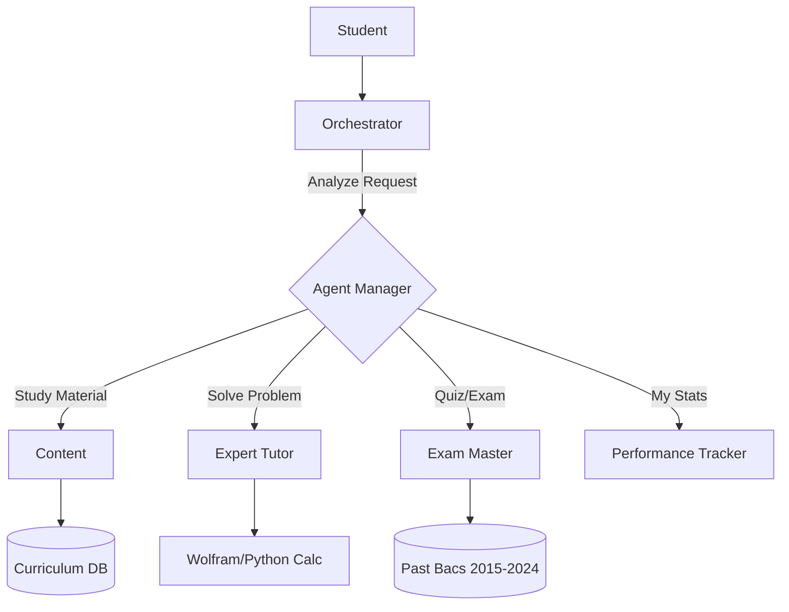

# Algerian Baccalauréat Feature Implementation Plan

## Overview
A comprehensive strategy to build an AI-powered Baccalauréat preparation platform tailored specifically for the Algerian curriculum. The goal is to provide personalized study paths, practice exams, and performance tracking for all official streams (Filières).

---

## 1. Supported Streams (Filières) & Complexity

To succeed in the Algerian market, the system must strictly adhere to the official streams and their coefficients (Ma3amil).

### A. The 7 Official Streams
| Stream (Filière) | Key Subjects (High Coefficient) | Complexity for AI |

----------------------------------------------------------
| **Sciences Expérimentales** | Natural Sciences (6), Physics (5), Math (5) | **High:** Requires diagram interpretation & scientific reasoning. |

----------------------------------------------------------
| **Mathématiques** | Mathematics (7), Physics (6) | **Very High:** Advanced calculus, algebra, mechanics. |

----------------------------------------------------------
| **Technique Mathématique** | Math (6), Physics (6), **Technology (6)** | **Extreme:** 4 distinct options (Civil, Mech, Elec, Process Eng). |

----------------------------------------------------------
| **Gestion et Économie** | Accounting/Math (6/5), Economics, Law | **Medium:** Structured data & logic. |

----------------------------------------------------------
| **Langues Étrangères** | Arabic, French, English, **3rd Language** (Span/Ger/Ital) | **Medium-High:** Nuance, translation, essay writing. |

----------------------------------------------------------
| **Lettres et Philosophie** | Philosophy (6), Arabic Literature (6) | **High:** Abstract reasoning, long-form essay evaluation. |

----------------------------------------------------------
| **Arts** (New) | Drawing, Music, Cinema | **Niche:** Developing suitable evaluation metrics. |

----------------------------------------------------------


### B. Critical Feature: "Calculator & Simulator"
Every student obsesses over their average (Moyenne). The system **must** include a simulator:
1.  **Select Stream:** e.g., "Technique Mathématique (Génie Civil)"
2.  **Input Marks:** Allow users to simulate "What if I get 14 in Math?"
3.  **AI Prediction:** "To get a mention 'Bien', you need at least 13 in Physics."

---

## Plan 1: The "Agentic" Architecture (Advanced)

### Concept
A multi-agent system where specialized "expert" agents collaborate. This is the **premium** solution, capable of complex reasoning (e.g., solving a multi-step Physics problem).

### Architecture Diagram


### Specialized Agents
1.  **Stream Specialist (The "Censor"):**
    *   *Role:* Ensures content matches the student's exact stream.
    *   *Logic:* A philosophy essay for "Lettres" (Coeff 6) requires deep analysis, while for "Sciences" (Coeff 2) it requires standard structure.
2.  **The "Technique" Expert:**
    *   *Role:* Specific retrieval for Génie Civil/Mécanique/Électrique diagrams and formulas.
3.  **The "Polyglot" Tutor:**
    *   *Role:* Switches seamlessly between Arabic (Darja) and French for scientific terms.

---

## Plan 2: The "LLM-Native" Architecture (MVP)

### Concept
A faster, efficient approach using a single powerful LLM (GPT-4o or Claude 3.5 Sonnet) wrapped in a robust **RAG (Retrieval Augmented Generation)** pipeline.

### Architecture Flow
1.  **User Query:** "Explain the 2019 Math Exercise 3 for Math Stream."
2.  **Retrieval (RAG):**
    *   Search `Bac_Math_2019.pdf`
    *   Search `Official_Grading_Scale_2019.pdf` (Barème)
3.  **Augmented Prompt:**
    *   "You are a strict Math corrector. Use the attached grading scale. The user is in the Math stream (implies rigorous proof required)."
4.  **Response:** Step-by-step solution with marking scheme.

### Prompt Engineering Strategy (Context-Aware)
```javascript
const systemPrompt = `
You are an expert Algerian Baccalauréat tutor.
CURRENT STUDENT PROFILE:
- Stream: ${student.stream} (e.g., Technique Math: Génie Mécanique)
- Level: ${student.level}

RULES:
1. STRICTLY follow the Algerian Ministry of Education curriculum.
2. For "Technique Math", use specific terminology for ${student.option}.
3. Answers must be structured: Definition -> Theorem -> Application -> Result.
4. If the user asks in Darja, reply in clear Arabic/French mix (scientific context).
`;
```

---

## Implementation Roadmap (Step-by-Step)

### Phase 1: Data Acquisition (Weeks 1-2)
*   **Action 1:** Scrape/Collect all Bac exams (2015-2024) for all 7 streams.
*   **Action 2:** OCR processing for "Technique Math" diagrams (critical bottleneck).
*   **Action 3:** Structure data into JSON: `{ "year": 2020, "stream": "Science", "subject": "Math", "exercise": 2, "topic": "Complex Numbers" }`.

### Phase 2: MVP Development (Weeks 3-5) - *Targeting Plan 2*
*   **Step 1:** Build the **"Coefficient Engine"** (Database of all streams/subjects/coefficients).
*   **Step 2:** Implement RAG pipeline using Pinecone/Supabase.
*   **Step 3:** Develop the Chat Interface with "Stream Selector" dropdown (mandatory on signup).

### Phase 3: Advanced Features (Weeks 6-8) - *Moving to Plan 1*
*   **Step 1:** Integrate "Image Input" (Student takes photo of their exercise).
*   **Step 2:** Add "Mock Exam" mode (Timer + Full Subject constraints).
*   **Step 3:** Deploy "Voice Mode" for verbal Q&A (great for History/Geo memorization).

---

## Technical Stack Recommendation

| Component | Technology | Why? |
| :--- | :--- | :--- |
| **Frontend** | React |

| **Backend** | Python (FastAPI) | Best ecosystem for AI/Agents (LangChain, LlamaIndex). |

| **Vector DB** | Supabase (pgvector) | Relational + Vector data in one place (great for user profiles). |

| **LLM** | GPT-4o (or Gemini 1.5 Pro) | Best multilingual & vision reasoning capabilities. |

| **OCR** | Mathpix / Google Vertex AI | Essential for reading math formulas and Arabic text. |

---

## Final Verdict
**Start with Plan 2 (LLM-Native)** but build the database schema for the **7 Streams** immediately. Do not launch without "Technique Math" support, as these students are the most underserved and willing to use such a tool.
